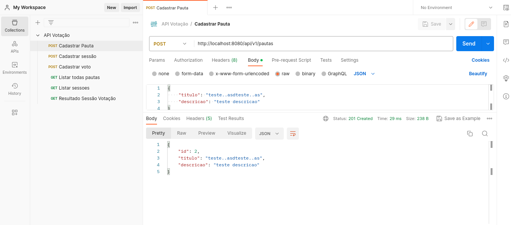
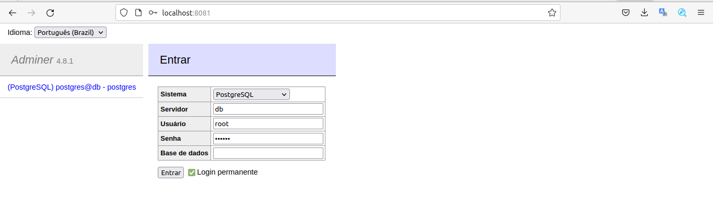
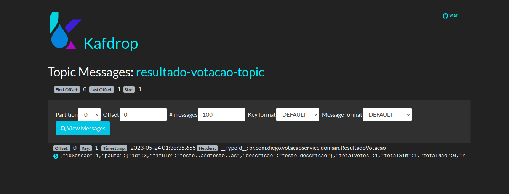

### Funcionalidades
* Cadastro de pauta
* Cadastro de sessão de votação de uma pauta (aqui ficou aberto para cadastrar n sessoes para uma pauta)
* Resultado de uma sessão de votação
* Envio do resultado de uma sessão de votação para tópico do kafka a cada 1 minuto

### Bonus
* Mensageria e filas (Envia resultado de votação para o kafka)
* Evolução da API (Existem algumas formas de evoluir uma API sem quebrar um cliente, seja versionando a API por URI, adiconando um novo endpoint ou ainda adicionando parametros opcionais - A abordagem escolhida aqui foi o versionamento via URL)

### Executando o projeto

Requisitos:
* Java 17
* Docker >= 20.10.22
* Docker compose >= 1.29.2

Acessar a pasta do projeto e rodar o comando:

```
docker-compose up --build
```

### Comunicando com API

O serviço está acessivel na porta 8080, disponibilizei uma [collection](arquivos/API Votação.postman_collection.json) do postman para facilitar:



### O banco de dados PostgreSQL pode ser acessado sem necessidade de um cliente em:

```
http://localhost:8081/
```

Banco: PostgreSQL<br/>
Servidor: db<br/>
Login: root/123456



### O Kafka pode ser acessado em:

```
http://localhost:19000/
```



